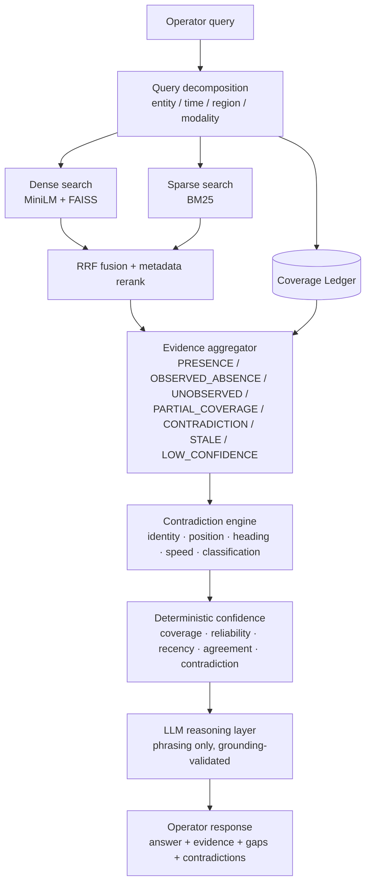

# Mission Intelligence — Coverage-Aware Retrieval & Reasoning

A research prototype that answers operator questions over heterogeneous sensor evidence
while keeping four things structurally distinct:

| State | Meaning |
|---|---|
| `PRESENCE` | Evidence indicates something was detected. |
| `OBSERVED_ABSENCE` | We observed the area and interval, and found nothing. |
| `UNKNOWN` | We did not observe it well enough to say anything at all. |
| `CONTRADICTION` | Sources disagree, and the system refuses to pick a winner. |

## The central design principle

> **An empty result is not evidence of absence. Observation coverage must be represented
> explicitly and evaluated independently of retrieval.**

Every RAG system can tell you what it found. Almost none can tell you what it *looked at*.
That distinction is the whole system here: a **Coverage Ledger** records what each sensor
observed — where, when, with what modality, and how well — and it is queried on a code path
that never touches the retrieval index. A negative report ("no contacts held") is only ever
promoted to `OBSERVED_ABSENCE` if the ledger independently confirms the area and interval
were actually observed. Otherwise the same sentence becomes `PARTIAL_COVERAGE` or
`UNOBSERVED`, and the answer becomes `UNKNOWN`.

The concrete consequence, measured on the golden set:

* **Fabrication rate on planted absences: 0.00** — no question whose ground truth is
  "we could not know" ever produced an absence claim.
* Sensor dropout on the same question moves it from `OBSERVED_ABSENCE` (confidence 0.84)
  to `UNKNOWN` (confidence 0.45) with coverage falling 0.95 → 0.71.
* Five near-duplicate poisoned records asserting "full coverage confirmed, Grid B7
  included" are retrieved, and change nothing: the ledger still says Grid B7 was dark.

---

## Architecture



The ledger hangs off the *query*, not off retrieval. That is the load-bearing detail: no
arrow runs from the retrieval path into the coverage path.

Text version and component-by-component notes: [`docs/architecture.md`](docs/architecture.md).

### Pipeline order (deterministic first, LLM last)

```
question
  -> decomposition                     deterministic rules (+ optional LLM refinement)
  -> [coverage check | dense | sparse] run concurrently (asyncio.gather)
  -> RRF fusion + metadata reranking   ranks, never raw score blending
  -> evidence classification           7 states, assigned in Python
  -> contradiction detection           rule-based, cross-source, never resolved
  -> state + confidence                deterministic; the model gets no vote
  -> LLM synthesis                     phrasing only, then grounding validation
```

---

## Quick start

```bash
pip install -r requirements.txt
```

```bash
python -m app.dataset.generator && python scripts/build_index.py
```

Run the five required demonstration scenarios:

```bash
python scripts/demo.py --quiet
```

Run the evaluation suite (retrieval-only benchmark, end-to-end, calibration sweep):

```bash
python scripts/run_evaluation.py --quiet
```

Run the failure-injection framework:

```bash
python scripts/run_failure_injection.py --quiet
```

Run the tests:

```bash
python -m pytest -q
```

### API

```bash
uvicorn app.api.main:app --reload --port 8000
```

| Method | Path | Purpose |
|---|---|---|
| `POST` | `/query` | Ask an operator question; returns the full structured answer + trace. |
| `POST` | `/ingest` | Add records and/or coverage entries (separate fields, by design). |
| `GET` | `/coverage` | Query the ledger directly — no retrieval involved. |
| `GET` | `/evidence/{id}` | One source record plus the coverage that did or did not back it. |
| `GET` | `/health` | Liveness, document/entry counts, versions. |
| `GET` | `/metrics` | Query counts, state distribution, latency percentiles, index config. |
| `POST` | `/evaluation/run` | Run the evaluation suite (`all`/`retrieval`/`end_to_end`/`calibration`). |

```bash
curl -s localhost:8000/query -H 'content-type: application/json' \
  -d '{"question":"Were there any contacts in Sector Alpha between 04:07 and 04:11?"}'
```

```bash
curl -s 'localhost:8000/coverage?region=grid_b7&start=04:07&end=04:11'
```

### UI

```bash
streamlit run ui/streamlit_app.py
```

The operator console shows the answer, a coverage bar, a **per-sub-region timeline** (so a
blind pocket inside a sector is visible rather than averaged away), the evidence table with
each item's epistemic state, contradictions with every conflicting claim preserved, the
deterministic confidence breakdown, and the full retrieval trace.

```
              04:00          04:20
minute        01234567890123456789
grid_a1       ████████████████████  100%
grid_a2       ████████████████████  100%
grid_a3       ████████████████████  100%
grid_b7       ███████░░░░█████████   80%
```

### Docker

```bash
docker compose up --build
```

API on `:8000`, UI on `:8501`. The image generates the dataset and warms the index at build
time; it needs no network and no API key at runtime.

---

## The synthetic world

Entirely fictional. No classified, sensitive or real-world operational data is used.

* **Regions** — three sectors decomposing into nine atomic grids, plus a deliberately
  confusable "Sector Alpha Training Annex" that is *not* part of Sector Alpha.
* **Sensors** — `radar_01`, `radar_02`, `eo_ir_01` (UAV, on station 03:45–05:35),
  `ais_rx_01` (cooperative traffic only), `rf_01`, `sat_img_01` (three passes), plus a
  `watch_officer` and a low-reliability `analyst_unverified` note source.
* **Modalities** — EO/IR, surface radar, AIS, RF, imagery, mission reports, standing
  orders, terrain metadata.
* **Mission clock** — 2026-08-22 03:30Z → 06:00Z, "now" = 05:40Z.

### Planted failure cases

| Case | What is planted | Where |
|---|---|---|
| **A — true absence** | Sector Alpha is genuinely empty 04:00–04:20 and well observed | `RADAR-101…106`, `EO-1201/2`, `AIS-1301`, `MR-001` |
| **B — blind window** | Total sensor blackout of Grid B7, 04:07–04:11 | ledger `NOT_OBSERVED` entries for every modality |
| **C — contradiction** | Grid B7 at ~05:20: radar 145°, AIS 310° and "V-17", report "V-21", EO "unidentified" | `RADAR-221`, `AIS-1312`, `MR-014`, `EO-1042` |
| **D — retrieval traps** | Near-identical negative sweeps from the training annex and from before the mission clock | `TRAP-802`, `TRAP-805`, `RADAR-090`, `MR-099`, `RF-610` |
| **E — multi-hop** | T-42 (04:00, Grid B2) → T-88 (05:20, Grid B7) with a 20-minute custody gap | `RADAR-210/211/212`, `RADAR-221/222`, `AIS-1310/1311`, `MR-021` |

The dataset generator enforces its own invariants: no contact may exist inside the planted
absence window, nothing at all may exist inside the blackout, and no sensing record may
exist while its own sensor is asserted blind. Unit tests re-check all three on every run.

---

## What the numbers say

Full detail, including the retrieval-only benchmark and the calibration sweep, is in
[`RESULTS.md`](RESULTS.md). Headline figures on the 50-question golden set:

| Metric | Value |
|---|---|
| Fabrication rate on planted absences | **0.00** |
| Answer-state accuracy | 1.00 (50/50) |
| Blind-window detection | 1.00 |
| Contradiction recall / false-positive rate | 1.00 / 0.00 |
| Ungrounded evidence citations | 0.00 |
| Confidence ↔ coverage correlation (Pearson) | 0.66, with 0 monotonicity violations |
| Mean end-to-end latency | 45 ms |

---

## Repository layout

```
app/
  api/            FastAPI service
  confidence/     deterministic confidence model + answer-state decision
  contradiction/  rule-based contradiction engine
  coverage/       THE COVERAGE LEDGER
  dataset/        synthetic world definition + generator
  evaluation/     golden set, metrics, harness, failure injection
  evidence/       evidence state classification and aggregation
  models/         Pydantic schemas
  reasoning/      decomposition, association, LLM layer, pipeline
  retrieval/      corpus, embedder, dense, sparse, fusion, rerank, hybrid
data/             generated dataset, coverage ledger, index manifest, eval reports
docs/             architecture notes
scripts/          generate_dataset · build_index · run_evaluation · run_failure_injection · demo
tests/            unit · integration · failure_injection
ui/               Streamlit operator console
```

---

## Constraints and honest limitations

This is a research/engineering prototype, not an operational system.

* Everything is synthetic and fictional by design.
* The default reasoning provider is a deterministic template synthesiser. It cannot
  hallucinate, which is exactly why the evaluation runs against it — but it also means the
  0.00 fabrication rate measures *the pipeline's* guarantees, not a language model's
  restraint. Switching `LLM_PROVIDER` to `anthropic`/`openai` routes phrasing through a
  real model, still fenced by the grounding validator (any answer citing an evidence ID
  that was not supplied is discarded, not patched).
* Retrieval quality is modest in absolute terms (recall@20 ≈ 0.73) on a deliberately
  adversarial corpus. That is partly the point: the safety properties hold *despite*
  imperfect retrieval, because they do not depend on it.
* Coverage adequacy weights, severity thresholds and the absence gate are hand-tuned
  constants in `app/config.py` and `app/dataset/world.py`. They are defensible, documented,
  and unvalidated against any real sensor model.
* The contradiction engine compares six dimensions with fixed tolerances. It will miss
  disagreements that require semantic interpretation of free text.
